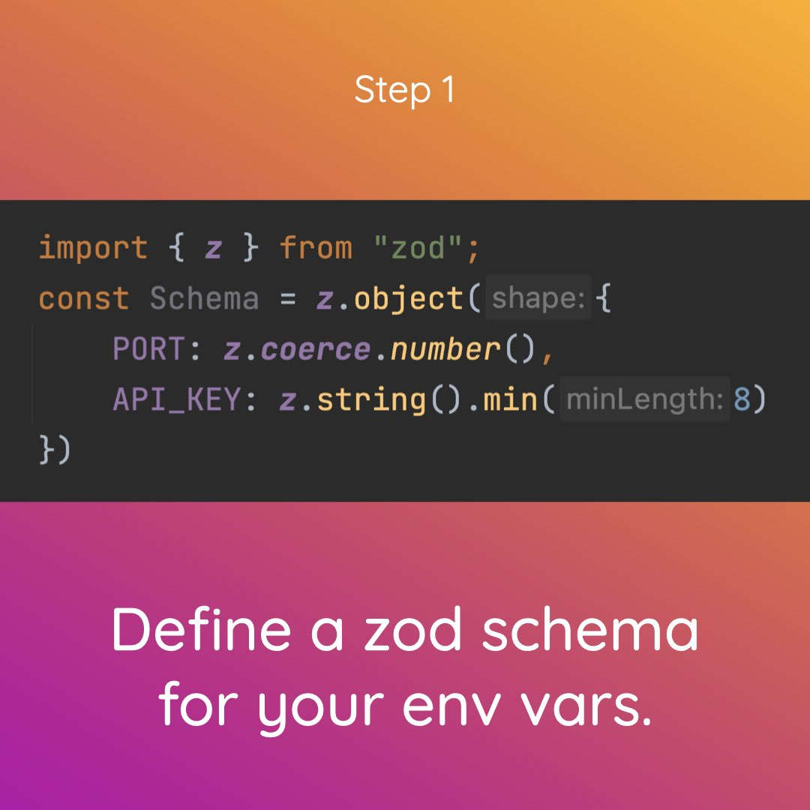
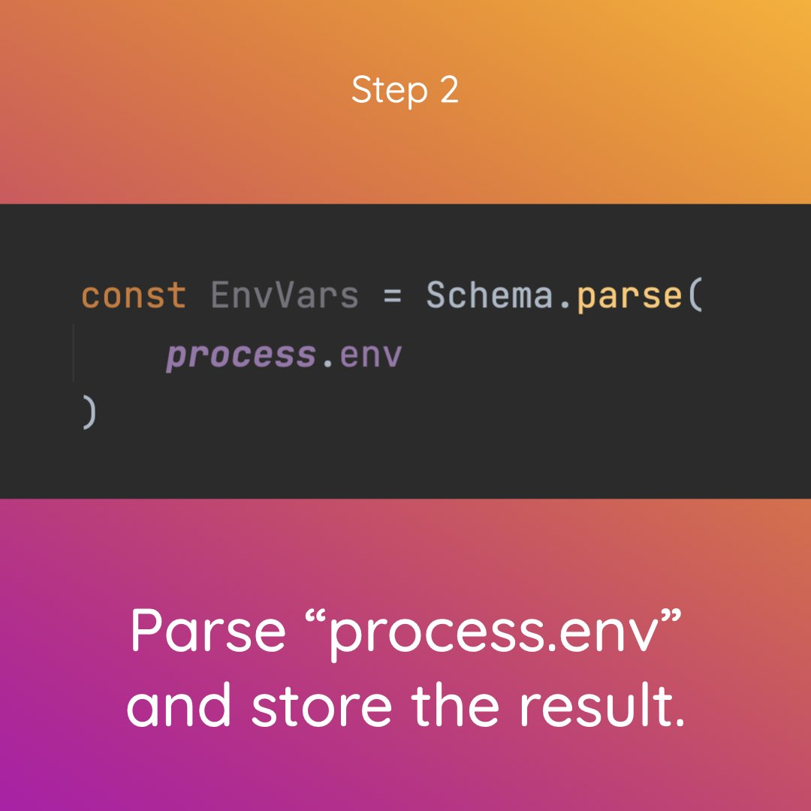
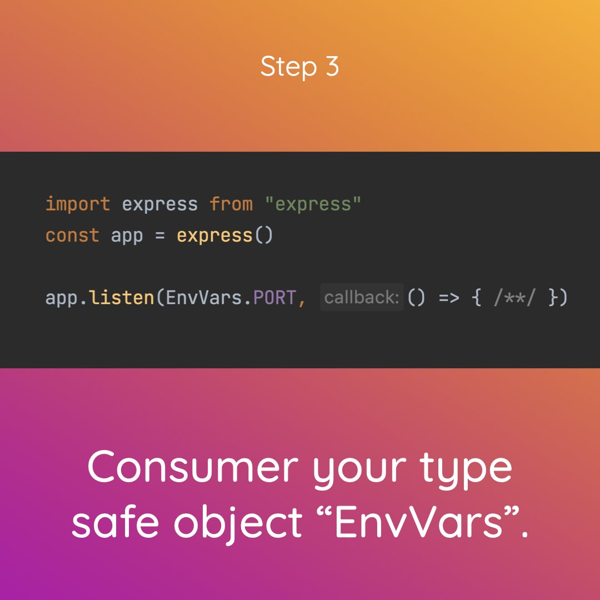

# 📘 LinkedIn post

# Text

Hey TypeScript engineers! 👋 Supercharge your environment variables by using Zod 💎!

It's Code Bite time! 🍔 (001)

Zod 💎 is a library written by Colin McDonnell. It is most commonly from tRPC – an essential part of Theo Browne's t3 stack!

Zod allows you to declare type schema using JS/TS. You then can use the schema to
- parse/validate data
- and infer TypeScript types from the schema.

Supercharge your way of working with environment variables by using Zod for that too!
- Validated environment variables ☑️
- Access them with type safety 😎

Here is how to do it:
- Install Zod 💎.
- Create a Zod object schema.
- Parse "process.env" with the schema.
- Export the parse result as a const.
- Use the exported object for every env var consumer.

Do you want to have fun? 🤗 Check out the code example on GitHub. The link is in the comments. ⬇️

#typescript #javascript #zod #trpc #t3stack #trpc #softwareengineering #validation #typesafety #environment #variables

# Slideshow

## Slide 1

## Slide 2

## Slide 3

## Slide 4

## Slide 5
